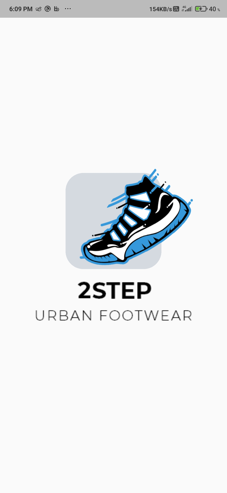

<div align="center"> 
    
    <h2 align="center"><b>Two Step</b></h2>
    <h3 align="center">
        A Shoe selling e-commerce App Template
    </h3>
</div>

<div align="center">
    <br><br>
    <h3 align="center">made</h3>
    
    <h3 align="center">
        <i>
        Implemented with Dart's Sound Null-Safety for stable, performant and efficient application
        </i>
    </h3>
    <br><br>
</div>

---

<div><br></div>

## Table of Contents
1.  About
1.  Built With
1.  Screenshots
1.  How can you use it ?
    - Prerequisites
    - Usage
1. Contact


# About
#### It is an example UI Template application for a Shoe selling app, with smooth and intuitive animatios and micro-interactions for eye catching scenes. Also the Splash-Screen is build using Rive.

<div><br><br></div>

# Built With
#### This application is built using Flutter, Rive and Dart which is an underlying language which Flutter requires.

<div align="center" display="block">
<br>


</div>

<br><br></div>

# Screenshots
### Here are the App Screenshots
- Animations
<br><br>
<video autoplay src="assets/media/two-step-video.mp4" height=512>

- Splash Screen
<br><br>


- Login Screen
<br><br>


- Signup Screen
<br><br>


- Home Screen
<br><br>


- Product Details Screen
<br><br>


# How can you use it ?
#### You need to follow this simple steps to execute this application locally on your machine

## Prerequisites
1. Flutter SDK must be installed -> [How to do it ?](https://flutter.dev/docs/get-started/install)
1. Basic knowledge of Flutter & Android


## Usage
1. Clone the project by command
    ```
        git clone https://github.com/mayurnile/twostep
    ```
1.  Execute the app!

<div><br><br></div>

# Contact
Mayur Nile - [Linkedin](https://www.linkedin.com/in/mayurnile/) - mayurnile95@gmail.com

Project Link: [https://github.com/mayurnile/twostep](https://github.com/mayurnile/twostep)